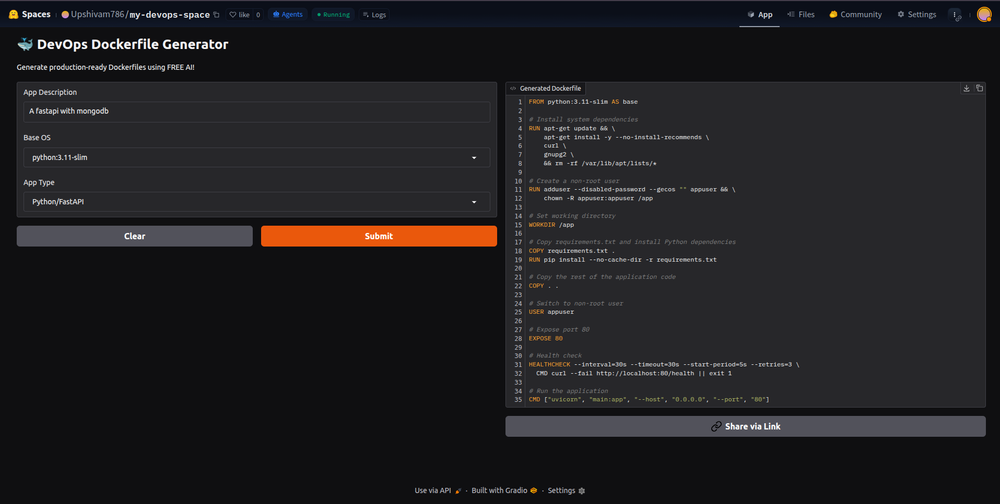

````markdown
---
title: DevOps Dockerfile Generator
emoji: 🐳
colorFrom: blue
colorTo: indigo
sdk: gradio
sdk_version: 5.29.0
app_file: app.py
pinned: false
---

# 🐳 DevOps Dockerfile Generator

Generate production-ready Dockerfiles instantly using open-source LLMs and Hugging Face inference APIs.

🔗 Live Demo: https://huggingface.co/spaces/Upshivam786/my-devops-space

---

## 🚀 Features

✅ Generate Dockerfiles from simple application descriptions  
✅ Supports multiple application stacks  
✅ Production-ready Dockerfile structure  
✅ Security best practices included  
✅ AI-powered DevOps automation  

Generated Dockerfiles can include:

- Multi-stage builds
- Non-root user setup
- Health checks
- Optimized dependency installation
- Clean production structure
- Helpful comments

---

## 🛠️ Tech Stack

- Python
- Gradio
- Hugging Face Spaces
- Hugging Face Inference API
- Qwen2.5-72B-Instruct
- Docker

---

## 📦 Supported App Types

- Python / FastAPI
- Node.js
- React
- Go
- Java / Spring

---

## ⚙️ How It Works

1. User enters:
   - App description
   - Base OS
   - Application type

2. The app sends the prompt to an LLM through Hugging Face Inference API

3. The model generates a production-ready Dockerfile

4. Output is displayed directly in the Gradio UI

---

## 🧠 What I Learned

This project helped me explore:

- AI application deployment
- Hugging Face Spaces
- LLM inference APIs
- API authentication & secrets management
- Model/provider compatibility debugging
- Prompt engineering for DevOps workflows
- Git-based deployment workflows

---

## 📂 Project Structure

```bash
.
├── app.py
├── README.md
├── requirements.txt
└── .gitignore
````

---

## ▶️ Run Locally

Clone the repository:

```bash
git clone https://github.com/Upshivam786/llm-dockerfile-generator.git
cd llm-dockerfile-generator
```

Install dependencies:

```bash
pip install -r requirements.txt
```

Set your Hugging Face token:

```bash
export HF_TOKEN=your_token_here
```

Run the application:

```bash
python app.py
```

---

## 🔐 Environment Variables

| Variable | Description            |
| -------- | ---------------------- |
| HF_TOKEN | Hugging Face API token |

---

## 🌐 Deployment

This project is deployed on Hugging Face Spaces using Gradio.

Live Space:
https://huggingface.co/spaces/Upshivam786/my-devops-space

---

## 📌 Future Improvements

* Kubernetes YAML generation
* Docker Compose generation
* CI/CD pipeline generation
* Terraform template generation
* Multi-cloud deployment templates
* Docker security scanning suggestions

---

## 🤝 Contributing

Contributions, ideas, and feedback are welcome.

Feel free to fork the project and improve it.

---

## 📄 License

MIT License

```
```
